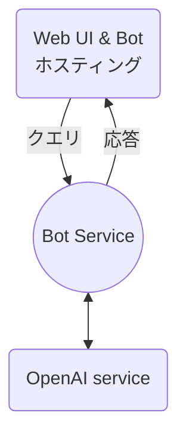

# Azure OpenAI service を使ったシンプルなチャットボット

[](https://github.com/michalmar/openai-demos-bot-webapp/actions/workflows/main_openai-bot-webapp.yml)

## 更新情報:
> このリポジトリでは、Azure OpenAI Service の `ChatGPT-turbo` モデルが使用されるようになりました。基本的にはプロンプトのみがわずかに変更され([ChatML](https://learn.microsoft.com/en-us/azure/cognitive-services/openai/how-to/chatgpt?pivots=programming-language-chat-ml)構文のため)、残りのコードとロジックに変更ありません。

## 紹介
チャットボットは、人間とコンピューターの間の相互作用を作成するために使用されるコンピュータープログラムです。OpenAI `gpt-35-turbo` は、人間の言語を理解するために開発されたニューラルネットワークに基づく最新の言語モデルです。この記事では、[Azure OpenAI](https://learn.microsoft.com/en-us/azure/cognitive-services/openai/) `gpt-35-turbo` モデルに基づいて効果的なチャットボットを作成する方法に焦点を当てます。

OpenAI ファミリーには、現在利用可能な多くのモデルがあり、焦点(自然言語、コード、画像)だけでなく、複雑さと何ができるかも異なります。[Azure ドキュメント ](https://learn.microsoft.com/en-us/azure/cognitive-services/openai/concepts/models)で素晴らしい紹介と例を見つけることもできます。

## 目標

目標は、最小限の労力でシンプルなチャットボットを作成することです。すでに利用可能なサービスとコンポーネントを、わずかな変更を加えるだけで使用します。

**チャットボットにはどのようなコンポーネントがありますか?**

チャットロジック - チャットボットの心臓部は、ユーザーの入力、質問、リクエストに応答する機能です。ユーザーが何を求めているかを理解し、あいまいな場合は追加情報を求め、(可能であれば正しい)答えを提供する必要があります。ここでは、[Azure OpenAI](https://learn.microsoft.com/en-us/azure/cognitive-services/openai/) サービスに依存します。

フロントエンド、またはGUIは、ほとんどの場合、独自のチャットボットとのユーザーコミュニケーションを仲介するWebアプリケーションです。ただし、多くの場合、このようなチャットボットは複数のそのようなインターフェイスを持つことができます:ユーザーの一部はWebサイトを介して通信し、一部はモバイルアプリを使用し、別の部分は、たとえば、Teamsプラットフォーム内で通信できます。これは、チャットボットがチャネルごとに個別にボットを編集することなく、複数のチャネルを使用することを意味します。

チャネルを介した通信は [Azure Bot Service](https://azure.microsoft.com/en-us/products/bot-services/#features) によって提供され、さまざまなチャネル (Web/Direct、Teams だけでなく、LINE、電子メール、SMS、Slack など。 [詳細はこちら](https://learn.microsoft.com/en-us/azure/bot-service/bot-service-channels-reference?view=azure-bot-service-4.0)) との通信を公開および管理できます。

使用しているサービスとツール:
- Azure OpenAI - チャットボットの心臓部/ロジック
- Azure App Service (Web App) - GUI の公開とチャットボットのホスティング
- Azure Bot Service - さまざまなチャネルを介した通信を管理するためのサービス

## アーキテクチャ/ソリューション設計



## 実装

手順は簡単です。用意されたテンプレートやサンプルを最大限活用します。

### OpenAI Service の作成

最初のステップでは、OpenAIサービスを作成します-このためには、[フォームに記入](https://customervoice.microsoft.com/Pages/ResponsePage.aspx?id=v4j5cvGGr0GRqy180BHbR7en2Ais5pxKtso_Pz4b1_xUOFA5Qk1UWDRBMjg0WFhPMkIzTzhKQ1dWNyQlQCN0PWcu)する必要があります。このサービスの一環として、Azure OpenAI Studio にアクセスして、GPT3.5 モデルである `gpt-35-turbo` モデルを選択してデプロイすることから始めることができます。同時に、モデルと独自のプロンプトをテストすることができる「Play Ground」のオプションを提供します。


### チャットボットの作成 - コードの編集

2番目のステップは、ボットフレームワーク内に独自のボットを作成することです、または単純な[echo bot](https://github.com/microsoft/BotBuilder-Samples/tree/main/samples/typescript_nodejs/02.echo-bot)と呼ばれるWebチャットボットのテンプレートから始めます。私はJavaScript/TypeScriptを選びましたが、PythonやC#の例もあります。

チャットアプリケーション独自のロジックを確認できる`bot.ts`ファイルでは、ユーザーからのメッセージの到着に反応する`onMessage`メソッドに焦点を当てます。

```javascript
this.onMessage(async (context, next) => {
    const replyText = `Echo: ${ context.activity.text }`;
    await context.sendActivity(MessageFactory.text(replyText, replyText));
    // By calling next() you ensure that the next BotHandler is run.
    await next();
});
```

このメソッドを変更して、変数 `context.activity.text` のユーザー入力 (クエリまたはコマンド) を OpenAI Service 
に送信して回答を取得し、その後、OpenAI からの回答をユーザーへの回答 (`data.choices[0].text `) で使用するようにします。

```javascript
this.onMessage(async (context, next) => {
    
    const requestBody =     {
        prompt: context.activity.text
        , max_tokens: 500
        , temperature: 0.7
    };
    const data = await postDataToEndpoint(url, requestBody, headers);
    
    const replyText = `${ data.choices[0].text }`;

    await context.sendActivity(MessageFactory.text(replyText));
    
    // By calling next() you ensure that the next BotHandler is run.
    await next();
});
```

しかし、これは私たちがおそらく望むチャットボットではありません - 2つの基本的な機能を欠いています:
- チャットボットパーソナリティ - プロンプト
- コミュニケーションのコンテキストを保持する

**それを達成する方法は?**

OpenAIテキストモデルの操作は、主にプロンプトの正しい設定と調整で構成されます(詳細は[こちら](https://learn.microsoft.com/en-us/azure/cognitive-services/openai/how-to/completions))。チャットボットにこのプロンプトを使用します：

```
高度なチャットボットとしての主な目標は、ユーザーの能力を最大限に発揮できるようにすることです。これには、質問への回答、役立つ情報の提供、またはユーザー入力に基づくタスクの完了が含まれる場合があります。ユーザーを効果的に支援するためには、詳細かつ徹底した対応が重要です。例と証拠を使用して、ポイントを裏付け、推奨事項や解決策を正当化します。

<conversation history>

User: <user input>
Chatbot:
```

> ChatGPT バージョン:
> ```
> <|im_start|>system 高度なチャットボットとしての主な目標は、ユーザーの能力を最大限に発揮できるようにすることです。これには、質問への回答、役立つ情報の提供、またはユーザー入力に基づくタスクの完了が含まれる場合があります。ユーザーを効果的に支援するためには、詳細かつ徹底した対応が重要です。例と証拠を使用して、ポイントを裏付け、推奨事項や解決策を正当化します。<|im_end|>
>
><conversation history>
>
><|im_start|>user <user input><|im_end|>
>
><|im_start|>assistant


最初の部分では、モデルが入力されたテキストに対してどのように動作するかについての指示があります - 意思決定、補完をサポートするための例を含む答えを与えます。これは、パーソナリティチューニングも現れる可能性がある場所です、例えば:専門的または激しく振る舞うなどです。

次に、次のセクション `<conversation history>` は会話の履歴を保持し、チャットボットの入力と出力を徐々に追加します。この部分は、チャットボットが通信のコンテキストを正しく理解するために重要です。

次は `User: <user input>` で、ユーザー入力を追加します。

関数全体は次のようになります:

```javascript
this.onMessage(async (context, next) => {
    
    // construct prompt
    let tmp_prompt = prompt.replace("<conversation history>", conversation_history).replace("<user input>", context.activity.text)
    
    // construct request
    const requestBody =     {
        prompt: tmp_prompt
        , max_tokens: 500
        , temperature: 0.7

    };

    // send request to OpenAI
    const data = await postDataToEndpoint(url, requestBody, headers);


    // update converstation historz
    conversation_history = conversation_history + "User: " + context.activity.text + "\nChatbot: " + data.choices[0].text + "\n"
    
    const replyText = `${ data.choices[0].text }`;

    await context.sendActivity(MessageFactory.text(replyText));
    
    // By calling next() you ensure that the next BotHandler is run.
    await next();
});
```

このようなチャットボットは、[Bot Framework Emulator](https://github.com/microsoft/BotFramework-Emulator)でローカルでテストできます:


### Azure へのデプロイ

チャットボットがローカル環境でリッスンして応答することをテストしたら、次の手順である Azure へのデプロイに進むことができます。これは2つの理由で行っています。

1. どこからでもサービスにアクセスできる必要があります
1. チャットボットを複数のチャネルで実行できるようにしたい

開発に[VS Code](https://code.visualstudio.com/)を使用する場合(強くお勧めします)、(1クリック)デプロイ自体にAzure WebAppを操作するための拡張機能を使用できます。


これは1回限りのテストに適していますが、反復開発を容易にするために、[GitHubアクションを使用したAzure Webアプリへの自動デプロイ](https://learn.microsoft.com/en-us/azure/app-service/deploy-continuous-deployment?tabs=github)を使用することをお勧めします。

### Azure / Bot Service を構成する

ボット自体(エンジン)はすでにAzureでホストされています - コードを変更することなく、[Azure Bot Service](https://portal.azure.com/#create/Microsoft.AzureBot)を使用してボットを公開するだけで、複数のチャネルにアクセスできます。

前の手順で作成したWebアプリケーションのURLをボットサービス設定に入力するだけです-そのようなURLは、指定されたアプリケーションのFQDNに `api/messages` を加えたものです。

```url
https://YOUR-WEB-APP.azurewebsites.net/api/messages
```


すべてが正しければ、Azure ポータルの Bot Service 内の Web チャットでサービスを直接テストできます:


これにより、Webチャット、Microsoft Teams、フェイスブックメッセンジャー、LINE、Slack、Twilio SMSなど、いくつかのチャンネルにアクセスできるようになりました,...(完全なリストは  [ここ](https://learn.microsoft.com/en-us/azure/bot-service/bot-service-channels-reference?view=azure-bot-service-4.0)にあります)

### フロントエンド / Webアプリケーション

チャットボットが機能し、Azure にデプロイされたので、Web サイトへの最も一般的な統合をテストできます。最も簡単なオプションは、「iframe」を使用して統合を生成し、このコードをHTMLページに挿入することです。

```html
<iframe src='https://webchat.botframework.com/embed/YOUR-BOT-NAME?s=YOUR_SECRET_HERE'  style='min-width: 400px; width: 100%; min-height: 500px;'>
</iframe>
```

別のオプションは、ページへのWebChat統合を直接使用することです-詳細は[ここ](https://learn.microsoft.com/en-us/azure/bot-service/bot-builder-webchat-overview?view=azure-bot-service-4.0)にあり、ソースは[https://github.com/microsoft/BotFramework-WebChat](https://github.com/microsoft/BotFramework-WebChat/tree/main/samples/01.getting-started/a.full-bundle) にあります。

簡単に言えば、これらは簡単な統合やその他のカスタマイズを可能にするJSライブラリです:

```html
<!DOCTYPE html>
<html>
   <body>
      <div id="webchat" role="main"></div>
      <script src="https://cdn.botframework.com/botframework-webchat/latest/webchat.js"></script>
      <script>
         window.WebChat.renderWebChat(
            {
               directLine: window.WebChat.createDirectLine({
                  token: 'YOUR_DIRECT_LINE_TOKEN'
               }),
               userID: 'YOUR_USER_ID'
            },
            document.getElementById('webchat')
         );
      </script>
   </body>
</html>
```

ここで、 `YOUR_DIRECT_LINE_TOKEN` はボットサービス内のDirect Line通信のトークンであり、`YOUR_USER_ID` は選択したIDです（訳註：現在コード内には無し）。


> 重要: Webアプリケーションを構成するときは、トークン/パスワードをコードで直接使用せず、Webアプリケーションの環境変数/アプリケーション設定として使用することがベストプラクティスです(通常セキュリティが必要なため)。実際、この例(このリポジトリ)では、アプリケーションが正しく通信するために設定/入力する必要がある6つの変数を使用しています：
>
> `DIRECT_LINE_TOKEN`...ボット サービス チャネルからの設定
>
> `OPENAI_API_KEY`...Azure OpenAI Service への認証のためのキー
>
> Azure リソースへの認証のために Bot Service を作成するときに使用される `MicrosoftAppId` と `MicrosoftAppPassword` (独自のサービス プリンシパルを使用することも、既定値のままにすることもできます - 詳細は [こちら](https://learn.microsoft.com/en-us/azure/bot-service/provision-and-publish-a-bot?view=azure-bot-service-4.0&tabs=userassigned%2Ccsharp#plan-your-deployment))
>
> `AOAI_ENDPOINT`...Azure OpenAI Serviceのエンドポイント
> 
> `GPT_MODEL_NAME`...Azure OpenAI Serviceで使用するGPT-3.5 Turboのモデル名

このページには、準備したばかりのチャットボットが含まれています。WebChat フレームワークには多くのカスタマイズ オプションが用意されているため、色からチャット メンバー インジケーターの表示まで、ほとんど何でも変更できます - 詳細は [こちら](https://learn.microsoft.com/en-us/azure/bot-service/bot-builder-webchat-customization?view=azure-bot-service-4.0)。

チャットボットの外観は以下のようになります:


## まとめ

これは、Azure OpenAI サービスの強力なモデル `gpt-35-turbo` を使用しており、ほぼすべての質問に対する答えを知っている単純なチャットボットを作成する方法のデモンストレーションでした :-)

必要に応じて自分で試すことができます！オリジナルの完全なソースコードは以下のGitHubで入手できます: [https://github.com/michalmar/openai-demos-bot-webapp](https://github.com/michalmar/openai-demos-bot-webapp)。Azure OpenAI Service を使用するには、まずアクセスを要求する必要があります - [フォーム](https://customervoice.microsoft.com/Pages/ResponsePage.aspx?id=v4j5cvGGr0GRqy180BHbR7en2Ais5pxKtso_Pz4b1_xUOFA5Qk1UWDRBMjg0WFhPMkIzTzhKQ1dWNyQlQCN0PWcu)。